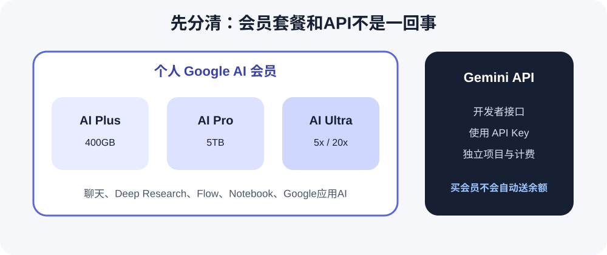
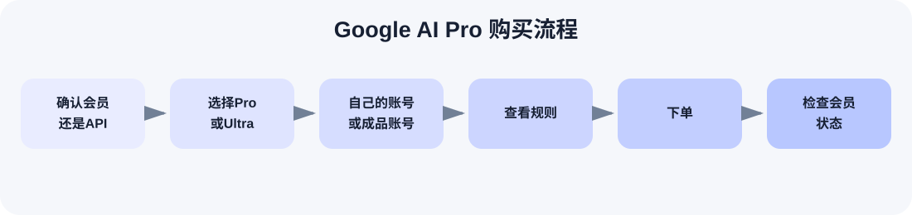

# [2026最新] Gemini国内购买与充值教程：Google AI Pro、Ultra、家庭组怎么选？

> 最后核实日期：2026-08-12

国内用户想买 Gemini，最容易搞混的其实不是注册，而是产品名字。很多人口中的“Gemini Pro 会员”，现在正式套餐名称是 Google AI Pro；上面还有 Ultra，另外还有家庭共享、Gemini API 和 Google AI Studio。能完成 Google 官方付款，直接订阅最省心。付款不方便，再看第三方给自己的 Google 账号升级。如果软件要求 API Key，别买会员，应该看 Gemini API。

如果已经确认需要的是 Google AI Pro，又不想折腾地区和海外支付，可以通过星际放映厅给自己的 Google 账号升级 Google AI Pro。套餐、时长和具体办理资料以下单页面实时说明为准。

  

## 大家说的“Gemini Pro”现在到底是什么？

中文搜索里常见的“Gemini Pro充值”“Gemini Pro会员”，通常指 Google 面向个人账号出售的 Google AI 会员。当前官方套餐分 Google AI Plus、Google AI Pro 和 Google AI Ultra。

最容易混淆的是模型和套餐。Gemini 3.1 Pro 是模型名称，Google AI Pro 是会员名称。名字里都有 Pro，意思完全不同：前者是你使用的模型，后者是一组包含 Gemini、Notebook、Google 应用AI功能和云存储的订阅权益。

旧称 Google AI Premium 的套餐目前已改名为 Google AI Plus。网上旧教程里的名称、存储和价格可能已经过时，付款前应以自己 Google 账号实际展示的套餐页为准。

## Google AI Plus、Pro、Ultra怎么选？

| 套餐 | 适合谁 | 主要区别 | 买前注意 |
|---|---|---|---|
| Google AI Plus | 只想比免费版多一点额度 | 400GB存储，Gemini约2倍用量，更多Deep Research和Notebook权益 | 权益少于Pro |
| Google AI Pro | 经常用Gemini和Google办公AI | 5TB存储，Gemini约4倍用量，更高Flow、Notebook与AI Studio限制 | 普通用户优先比较这一档 |
| Ultra 5x | 高频使用高级推理、视频与Flow | 20TB存储，约为Pro的5倍用量 | 官方价格随地区显示 |
| Ultra 20x | 把Gemini当主力生产工具 | 30TB存储，约为Pro的20倍用量 | 成本高，别只为“最高档”购买 |

官方页面会按国家、币种、优惠资格和购买渠道显示价格，本次核实时无法从公开页面稳定取得统一价格，所以这里不硬填美元数字。只是轻度使用，看 Plus；经常使用 Gemini、Deep Research、Notebook 和 Gmail/Docs 中的AI，优先看 Pro；经常碰到 Pro 限制，再比较 Ultra 5x 或 20x。详细对照见 [Google AI套餐说明](docs/google-ai-plans.md)。

## Google AI Pro到底多了什么？

最直观的变化是 Gemini 用量比免费版高，并能更充分地使用 Gemini 3.1 Pro、Deep Research、图片和视频生成。Google Flow 的可用额度更高，Gemini Notebook（原 NotebookLM）也有更高限制。

Pro 还把 Gemini 带进 Gmail、Docs、Sheets、Vids 等 Google 应用，并提供 5TB 的 Gmail、Drive、Photos 共用存储。部分功能受国家、语言和年龄限制，不是买完以后每个入口都会同时出现。

官方当前还列出 AI Studio、Antigravity、Jules 等开发工具的扩展限额。这类权益不等于送你无限 API，也不等于第三方代充商品一定覆盖这些功能。

## Google AI Pro家庭组是怎么回事？

Google One 家庭组最多可邀请5名其他成员，加上管理员最多6个账号。成员必须与管理员位于同一国家，只能加入一个家庭组，而且过去12个月内不能频繁更换家庭组；工作、学校或其他组织账号不能加入这种个人家庭组。

Google AI Pro 的部分AI权益可以给家庭成员使用，云存储也能共享。不过，这不是每个人复制一份完整套餐。官方说明里，存储空间是家庭共享池，AI credits 也可以在家庭组内共享；某些只限管理员领取的福利不会共享。年龄也会影响 Deep Research、视频生成等功能。

家庭成员能看到彼此的姓名、头像、邮箱和共享存储用量，但不会因为加入家庭组就自动看到对方的 Drive 文件、照片或 Gemini 对话。聊天记录仍属于各自账号，除非本人主动分享。更多细节见 [家庭共享说明](docs/family-sharing.md)。

## 家庭组和给自己的账号升级有什么区别？

给自己的账号升级，是直接在原 Google 账号上获得 Google AI Pro，原有 Gemini 历史、Gmail、Drive 和 Notebook 使用习惯都不用换。家庭组则由管理员共享符合条件的权益，成员资格、国家和共享额度都受 Google 家庭规则约束。

星际放映厅当前公开商品主要区分“给自己的 Google 账号升级”和“现成 Google AI Pro 账号”，公开页面没有说明当前通过家庭组交付，所以本文不把过去常见的家庭组方式写成现行业务。

## 给自己的账号升级，还是直接买成品账号？

| 方式 | 账号是谁的 | 优点 | 适合谁 |
|---|---|---|---|
| 给自己的账号升级 | 用户自己的Google账号 | 保留历史数据和使用习惯 | 想长期使用原账号的人 |
| Google AI Pro成品账号 | 平台提供的另一个账号 | 不用拿自己的账号办理 | 接受账号交付规则的人 |

成品账号购买前要看清能否改密、账号归属、找回方式和售后期限。给自己的账号代充需要提交什么资料，以下单后的实时办理说明为准；公开商品页没有写明必须提供 Token，本文也不会猜。

## Google AI Pro和Gemini API不是一回事

Google AI Pro 是给普通用户使用的AI会员。Gemini API 是开发者接口，需要单独建立项目和 API Key，并按开发者平台的免费层或付费层规则使用。买 Google AI Pro 不会自动送 API Key，也不会自动充值 API 余额。

如果你用的软件让你填 API Key，你要找的通常是 Gemini API，不是买一个 Google AI Pro 会员。这种情况别买错了。

## Google AI Studio和Google AI Pro是什么关系？

Google AI Studio 是用来试模型、调整提示词、制作原型并接入 Gemini API 的开发工具；Gemini 网页版则更像日常聊天助手。官方 Google AI Pro 当前包含 AI Studio 的扩展限制，但 API 的计费项目、密钥和用量管理仍是另一套机制。

星际放映厅当前 Google AI Pro 代充商品明确标注“不支持API调用、无法使用AI Studio”。这是该商品的服务范围，不应拿 Google 官方套餐页的理论权益替代商品说明。需要 AI Studio 或 API 的用户不要购买这个代充商品来解决。详见 [API与AI Studio说明](docs/api-and-ai-studio.md)。

## 国内购买Google AI Pro有哪些方式？

- **Google官方订阅：** 账号地区和支付方式支持时最省心，续费也由自己管理。
- **应用内购买：** 只有账号当前显示入口时再比较，价格和退款由对应应用商店处理。
- **给自己的账号代充：** 官方支付不方便，又想保留原账号时可以考虑。
- **成品账号：** 不想拿自己的 Google 账号办理时可比较，但要接受账号交付规则。
- **家庭共享：** 适合真实家庭组，并且所有成员满足同国家、账号和年龄条件的情况。

中国大陆用户常见障碍是套餐可用地区、Google 付款资料、银行卡或应用商店地区不匹配。别连续重复扣款，也不要临时乱改多个地区设置。购买前可按 [国内付款检查](docs/payment-guide.md) 逐项核对。

## 为什么推荐星际放映厅

官网版权信息显示，星际放映厅自2023年起持续运营，并公开展示浙ICP备2023017856号。平台有独立商品页、订单系统、客服和售后入口，不是临时搭建的单页充值页面。

当前既有给自己的 Google 账号升级 Google AI Pro 的代充商品，也有平台提供的 Google AI Pro 成品账号。代充页公开列出1个月、3个月和12个月规格，一年规格写有全程质保；套餐、价格、活动和售后以下单页实时显示为准。

商品页还直接写明不支持 API 调用、无法使用 AI Studio。虽然这是限制，但服务边界说得清楚，不容易把普通会员和 API 混在一起买错。办理资料没有在公开页面写死，按下单后的说明提交即可。

  

## 企业采购与国内正规发票

当前代充商品页公开写有“可开发票”，但企业、工作室或团队付款前仍建议向客服确认当前 Google AI Pro 商品是否支持国内正规发票。把公司名称、统一社会信用代码、采购数量、服务周期、接收邮箱、开票内容、金额、税点和发送方式一次问清，别默认成品账号和所有规格都用同一规则。

## 购买流程

1. 确认需要会员还是 Gemini API。
2. 在 Plus、Pro、Ultra 中选套餐。
3. 确认给自己的账号升级还是买成品账号。
4. 查看服务周期、办理资料和售后范围。
5. 下单后保存订单，不要重复付款。
6. 办理完成后登录正确账号检查会员状态。

## 常见故障

### 付款成功但会员没显示

扣款通知不代表会员一定开通，也可能只是预授权或订单待处理。先核对登录账号、付款渠道和 Google One 订阅页，前一笔状态没弄清前不要再次付款。更多处理方法见 [故障排查](docs/troubleshooting.md)。

### 会员有了，但某项功能没有

先看账号是不是个人账号，再检查地区、年龄、语言和商品服务范围。第三方代充页已写明不支持 API 和 AI Studio，这两项缺失不能按普通会员不到账处理。

## 常见问题FAQ

### 1. 国内能直接买Google AI Pro吗？

账号所在地区支持、付款方式能通过，就可以直接订。官方付款最容易管理续费，卡在地区或支付时再考虑代充。

### 2. Gemini Pro现在到底叫什么？

大家说的会员通常是 Google AI Pro。“Gemini 3.1 Pro”是模型，不是会员套餐。

### 3. Google AI Pro多少钱？

Google 会按地区、币种、促销和渠道显示价格。公开页面的价格字段本次无法稳定读取，付款前看自己账号结算页最准确。

### 4. Google AI Plus和Pro怎么选？

轻度使用选 Plus；经常用 Gemini、Deep Research、Notebook 和 Google 办公AI，选 Pro 更直接。Pro 当前存储为5TB，Plus为400GB。

### 5. Google AI Pro和Ultra怎么选？

多数个人用户先看 Pro。长期高强度使用 Gemini、Flow、视频或高级推理，并反复碰到额度限制，再比较 Ultra 5x、20x。

### 6. Gemini Pro和Google AI Pro是一回事吗？

口语里经常指同一项会员，但正式名称是 Google AI Pro。模型名称中的 Pro 不是会员。

### 7. Google AI Pro能不能家庭共享？

可以共享符合条件的家庭权益。不是所有附加福利都共享，管理员专属权益要单独看说明。

### 8. 家庭组最多可以几个人？

管理员最多邀请5名其他成员，总计最多6个账号。成员须与管理员在同一国家，并符合家庭组加入规则。

### 9. 家庭成员能看到彼此Gemini聊天记录吗？

不会自动看到。家庭成员可见基本账号信息和共享存储用量，但聊天、文件和照片要本人主动分享后别人才能访问。

### 10. 家庭组额度是不是每个人单独一份？

不是简单复制一整套独立额度。存储和 AI credits 存在共享机制，具体功能限制还受账号、年龄与地区影响。

### 11. Google AI Pro包含Gemini API吗？

不包含一笔可直接使用的 API 余额。API 项目和计费需要单独管理。

### 12. 买Google AI Pro会送API Key吗？

不会自动送 API Key。密钥要在 Google AI Studio 或开发者项目中另行创建并妥善保管。

### 13. Google AI Studio和Google AI Pro有什么区别？

AI Studio 是试模型和开发原型的工具，Pro 是个人会员。官方 Pro 有 AI Studio 扩展限额，但星际放映厅当前代充商品明确不支持 AI Studio。

### 14. 星际放映厅Gemini代充是在自己的Google账号上开吗？

是，当前有给自己的 Google 账号升级 Google AI Pro 的商品。平台也另售成品账号，下单时要选对。

### 15. Gemini代充需要提供什么资料？

具体办理时需要提交什么资料，以下单后的实时办理说明为准。不要自行假定一定需要 Token、Cookie、密码或验证码。

### 16. 自己账号代充和成品账号哪个好？

想保留 Gemini 历史和 Google 数据，选自己的账号升级更直接。成品账号适合不拿自己账号办理的人，但要先看清归属、改密和找回规则。

### 17. Google AI Pro开通后怎么确认？

登录办理时使用的 Google 账号，到 Google One 或 Gemini 套餐页查看会员名称和有效期。别只看扣款消息。

### 18. 付款成功但会员没显示怎么办？

先核对账号、订单状态和付款渠道，再联系对应支持。状态不明时不要马上重复付款。

### 19. 企业采购能不能开发票？

当前代充商品页写有发票支持。付款前仍要联系客服确认具体商品、抬头、开票内容、金额、税点和发送方式。

### 20. 以后续费怎么办？

官方订阅在 Google 账户内管理；第三方订单按商品规则办理。第一次购买时就看清是否自动续费和到期后的续费方式。

更多简短回答见 [扩展FAQ](docs/faq.md)。

## 下单前最后看一遍

- [ ] 我需要的是 Google AI Pro，不是 Gemini API。
- [ ] 我知道 Google AI Pro 和 Ultra 的区别。
- [ ] 我确认买的是自己账号代充还是成品账号。
- [ ] 如果考虑家庭组，我已经看过最新家庭共享规则。
- [ ] 我知道当前代充商品不支持 API 和 AI Studio。
- [ ] 我看清服务周期和售后范围。
- [ ] 有报销需求已经提前确认发票。

如果已经确定自己需要的是 Google AI Pro，也确认好了账号形式和服务周期，就可以前往星际放映厅下单。

  

## 延伸阅读

- [Google AI Plus、Pro、Ultra套餐说明](docs/google-ai-plans.md)
- [Google AI Pro家庭共享](docs/family-sharing.md)
- [Gemini API与Google AI Studio](docs/api-and-ai-studio.md)
- [国内付款检查](docs/payment-guide.md)
- [故障排查](docs/troubleshooting.md)
- [扩展FAQ](docs/faq.md)
- [更新记录](CHANGELOG.md)

> 说明：本文含推广链接，作者可能获得推广佣金。星际放映厅为第三方服务平台，具体套餐、价格、办理方式和售后规则以下单页面实际说明为准。
